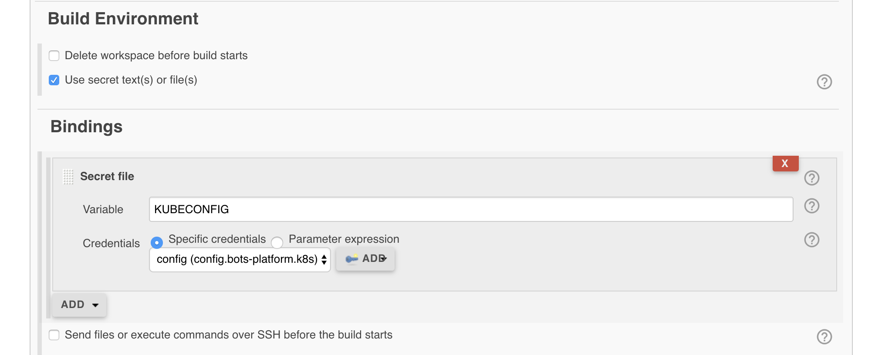
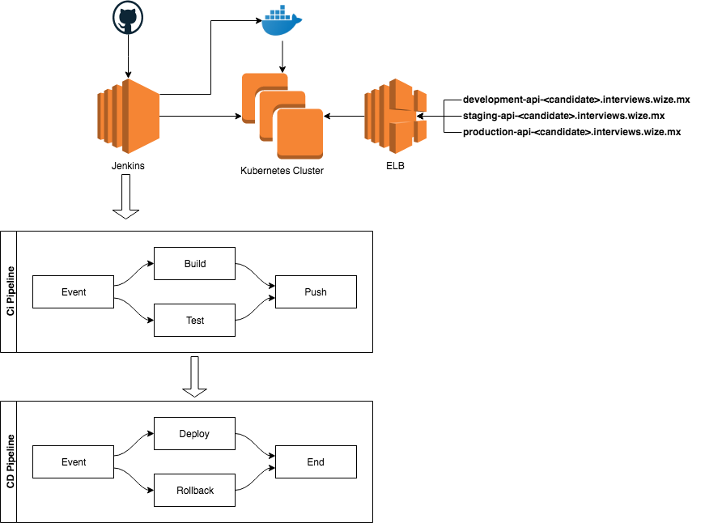

# Wizeline DevOps task

Welcome to the Wizeline DevOps task.

This repository contains an API skeleton where you can add your code,
choose the language of your preference.

## What do we expect from you?

* Demonstrate you have great coding and operation skills, no matter which
technology stack is used.

* This is not an exam, this is more a task that has been assigned to you,
so you can ask us at anytime.

* Communication is important, if you don't have technical problems make sure
to share your progress.

## Application Overview

You need to complete a functionality in our API that provides some help to
the networking team.

The API has 3 missing endpoints, the first endpoint converts Subnet Mast to
CIDR format, the second endpoint return the CIDR value of a given Subnet Mask
and finally the third endpoint simply validates an IPv4.

e.g.

```bash
curl localhost/cidr-to-mask?value=24
{
  "function": "cidrToMask",
  "input": "24",
  "output": "255.255.255.0"
}
```

```bash
curl localhost/mask-to-cidr?value=255.255.0.0
{
  "function": "maskToCidr",
  "input": "255.255.0.0",
  "output": "16"
}

```

```bash
curl localhost/ip-validation?value=255.255.0.0
{
  "function": "ipv4Validation",
  "input": "255.255.0.0",
  "output": true
}

```


## What do you need to do?

### Coding
  * Complete the following endpoints.
   - `/mask-to-cidr?value=<VALUE>`
   - `/cidr-to-mask?value=<VALUE>`
  * The following endpoint is not required for this phase.
   - `/ip-validation?value=<VALUE>`
  * Make sure your tests are passing
  * Add missing tests
  * You should pick one from a list of available languages.
    - [Python](cidr_convert_api/python)
    - [Go](cidr_convert_api/go)
    - [Java](cidr_convert_api/java)
    - [NodeJS](cidr_convert_api/node)
    - [Ruby](cidr_convert_api/ruby)

### Continuous Integration
  * Define a CI pipeline.
  * Ideally the pipelines must be checked in code (Jenkinsfile or Scripts).
  * Automate your tests every time a change is pushed to the repository.
    - Avoid buggy code to be deployed.
  * Build your artifacts (docker images) and store them in a registry
    with appropriate tagging.
  * Protect your branches.

### Continuous Delivery

  * Define your CD pipeline.
  * Deploy to your Production Environment based on your defined strategy.
  * Manage stage as production.
  * Deploy to your Testing Environment before deploying to stage or production.
  * Deploy with no downtime in production.

## Infrastructure Management

  You will have access to the following:

  * Jenkins server
  * Kubernetes Cluster
  * Docker registry 
  > Note: Your Jenkins instance is already logged into the private docker registry.

### How to access the infrastructure:
  * During the Task Presentation, the Wizeline team will provide:
    - Jenkins address, username and password.
    - Credentials for the kubernetes cluster.

### Using Jenkins

 * URL: http://jenkins-your-name.interviews.wize.mx
 
   Example: http://jenkins-john-doe.interviews.wize.mx
   
   Hint: Use the same name as in this repository without the `<wizeline-sre>` prefix
 * User: `admin`
 * Password: `bNmAZkd69hc8Yjhfsetgcj2dJH`

> **Notes:** 
 > - Be aware that the installation of some plugins may cause a missconfiguration of the Jenkins server and your work will be lost.
 > - Using sudo commands on your Jenkins pipeline is not allowed (example sudo pip install)

### Using Docker Builder
  * Docker is already integrated with Jenkins, in a job you could use this
  command to build an image

```
 docker build -t <your-name>:some-tag .
```

  * You will need to push data to a remote docker registry, for this you will
  need to do the following

```
 docker tag <your-name>:some-tag wizelinedevops/<your-name>:some-tag
 docker push wizelinedevops/<your-name>:some-tag
```
> **Note:** This only works from jenkins.

### Deploying to Kubernetes

In this section you will need to know.

  * How to deploy to kubernetes.
  * The kube config file.
  * The candidate must create a secret file in jenkins with the provided
  configuration file and use it as a parameter for `kubectl`.
    - Jenkins > Credentials > System > Global Credentials
    - [Jenkins Security](https://jenkins.interviews.wize.mx/credentials/store/system/domain/_/)

    


#### How to deploy to Kubernetes.

> **Note:** Make sure to use kubeconfig with the value set up in the
> Jenkins Credentials Section.

  * Update the version of the image in the kubernetes cluster, e.g.:
    - `kubectl --kubeconfig=${KUBECONFIG} --namespace=<ENVIRONMENT>
    set image deployment/api api=wizelinedevops/api:tag`

> **Note:** This only works from jenkins.

### Deployment Information

* Dev: `development-api-<your-name>.interviews.wize.mx`
* Stage: `staging-api-<your-name>.interviews.wize.mx`
* Production: `production-api-<your-name>.interviews.wize.mx`

### How your Infrastructure looks like.


